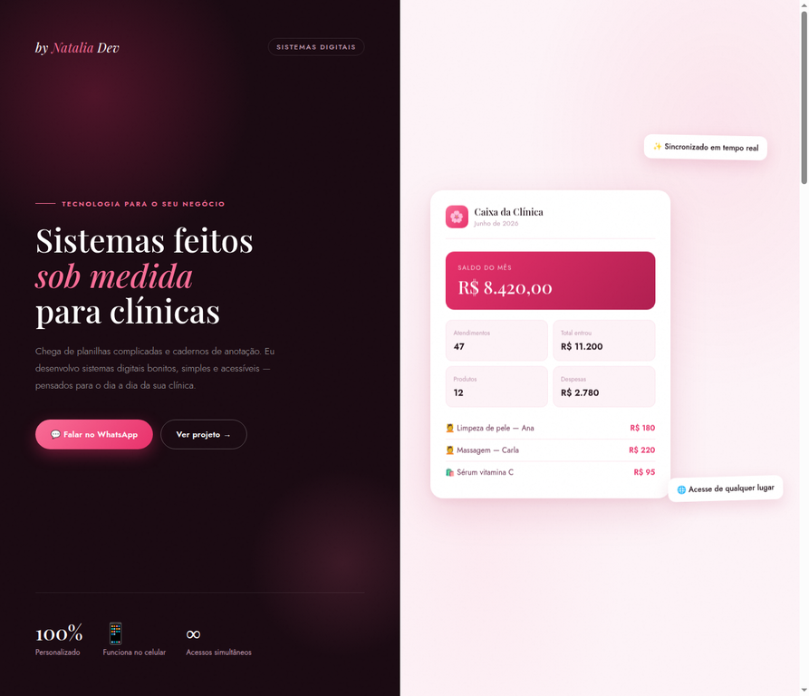

<p align="center">
  
</p>

<p align="center">
  <strong>Portfólio de sistemas digitais personalizados para clínicas de estética.</strong>
</p>

<p align="center">
  <a href="https://taliaalmeida.github.io/by-natalia-dev-ou-portfolio/"></a>
  
</p>

<p align="center">
  
  
  
  
</p>

> **01 // POSITIONING**  
> A By Natalia Dev cria sistemas web bonitos, simples e acessíveis para transformar rotinas manuais de clínicas em experiências digitais mais organizadas.

## 02 // SOBRE O PROJETO

Este repositório contém o site institucional e comercial da By Natalia Dev. A página apresenta os serviços oferecidos, o sistema em destaque, os planos mensais e os canais de contato para clínicas interessadas em uma solução sob medida.

<p align="center">
  <a href="https://taliaalmeida.github.io/by-natalia-dev-ou-portfolio/"><strong>🌸 Acessar o site ao vivo</strong></a>
</p>

## 03 // O QUE O SITE APRESENTA

| Seção | Objetivo |
| --- | --- |
| **Hero** | Comunica a proposta de sistemas feitos sob medida e direciona para WhatsApp ou projetos. |
| **Soluções** | Apresenta Fechamento de Caixa, Agenda Online e Site Institucional. |
| **Projeto em destaque** | Mostra o Sistema de Fechamento de Caixa para Clínica de Estética. |
| **Planos mensais** | Organiza valores, recursos incluídos e status de cada solução. |
| **Contato** | Oferece acesso direto ao WhatsApp e Instagram. |
| **Experiência visual** | Usa animações suaves, mockup de sistema e layout responsivo. |

## 04 // INTERFACE

A captura abaixo mostra a primeira dobra do site publicado: identidade By Natalia Dev, proposta de valor, chamada para WhatsApp e mockup do Caixa da Clínica com indicadores de saldo, atendimentos, entradas, produtos e despesas.

<p align="center">
  
</p>

<p align="center"><sub>Captura real do site publicado no GitHub Pages.</sub></p>

## 05 // SOLUÇÕES E PLANOS

Os valores abaixo correspondem à oferta exibida na página pública consultada. Atualize esta tabela sempre que os preços ou o status comercial forem alterados no site.

| Solução | Valor publicado | Status |
| --- | ---: | --- |
| **Fechamento de Caixa** | R$ 89/mês por clínica | Disponível e em destaque. |
| **Agenda Online** | R$ 89/mês por clínica | Em breve/lista de espera. |
| **Site Institucional** | R$ 119/mês por clínica | Disponível mediante orçamento/contratação. |

Cada plano apresenta recursos específicos, como acesso em celular e computador, sincronização entre usuárias, personalização visual, suporte e atualizações.

## 06 // TECNOLOGIAS

| Camada | Tecnologia |
| --- | --- |
| Interface | HTML5, CSS3 e JavaScript puro. |
| Tipografia | Playfair Display e Jost. |
| Hospedagem | GitHub Pages. |
| Dependências | Sem frameworks e sem dependências externas declaradas no README. |
| Comunicação | Links públicos para WhatsApp e Instagram. |

## 07 // COMO EXECUTAR

### Site online

Acesse [taliaalmeida.github.io/by-natalia-dev-ou-portfolio](https://taliaalmeida.github.io/by-natalia-dev-ou-portfolio/).

### Execução local

```bash
git clone https://github.com/taliaalmeida/by-natalia-dev-ou-portfolio.git
cd by-natalia-dev-ou-portfolio
python3 -m http.server 8000
```

Abra [http://localhost:8000](http://localhost:8000) no navegador.

### Publicação no GitHub Pages

No repositório, acesse **Settings → Pages**, escolha a branch `master`, selecione `/ (root)` e salve. O ponto de entrada é o arquivo `index.html`.

## 08 // ESTRUTURA

```text
by-natalia-dev-ou-portfolio/
├── index.html    # Página institucional completa
└── README.md     # Documentação do projeto
```

## 09 // ROADMAP

| Prioridade | Evolução sugerida |
| --- | --- |
| Alta | Adicionar uma seção de estudos de caso com problema, solução, stack e resultado de cada projeto. |
| Média | Separar HTML, CSS e JavaScript para facilitar manutenção e colaboração. |
| Média | Adicionar SEO técnico, favicon, metatags Open Graph e analytics com consentimento. |
| Média | Criar formulário de orçamento com validação e proteção antispam. |

## 10 // CONTATO

- [WhatsApp](https://wa.me/5521970189097)
- [Instagram](https://www.instagram.com/nataliaalmeidatech)
- [Perfil no GitHub](https://github.com/taliaalmeida/taliaalmeida)
- [Site ao vivo](https://taliaalmeida.github.io/by-natalia-dev-ou-portfolio/)

## 11 // AUTORIA

Desenvolvido por **Natalia Almeida — By Natalia Dev**.

<p align="center">
  <sub>Learn. Build. Automate. Evolve.</sub>
</p>
